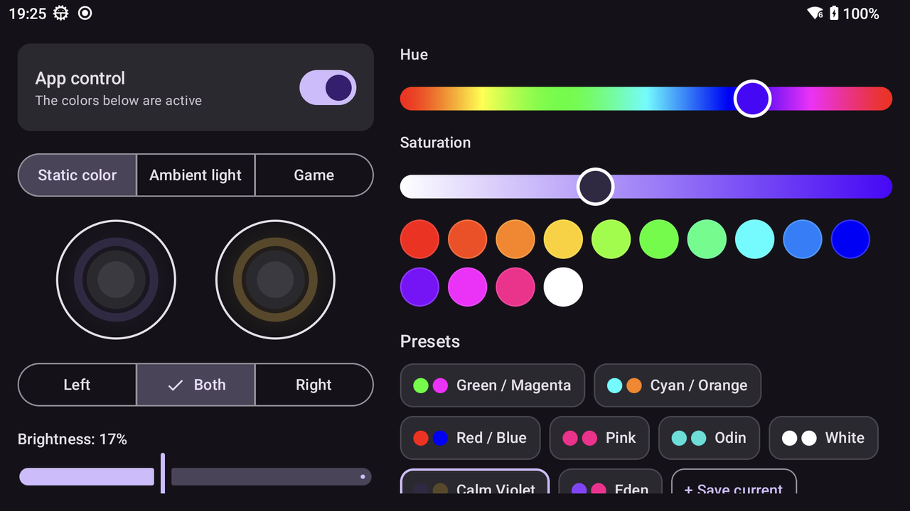

<p align="center">
  
</p>

<h1 align="center">AmbiAnalog</h1>

<p align="center">
  Joystick LED control for the <b>AYN Thor</b> - static colors, ambient light and colors that follow your game.
</p>

<p align="center">
  <a href="https://github.com/mkaflowski/AmbiAnalog/releases/latest"></a>
  <a href="https://github.com/mkaflowski/AmbiAnalog/releases"></a>
</p>

<p align="center">
  
</p>

## Features

- **Static colors** - a color per stick, brightness, built-in and your own presets.
- **Ambient light** - the sticks follow the left and right half of the top screen.
- **Game mode** - colors from the cover of the game you're playing (Cocoon artwork for Eden, Azahar, RetroArch and other emulators), from Android game icons, or your own colors per game. Switching games fades smoothly.
- **Quick Settings tile** - dim the LEDs, or bring the app back after Android closed it. Long-press opens the app on the bottom screen.
- **Extended mode** (optional) - pairs with the Thor's own wireless debugging, like Shizuku, so your colors stay after the app is closed or the device restarts.

English and Polish.

## Install

Download the APK from [Releases](https://github.com/mkaflowski/AmbiAnalog/releases/latest) and install it on the Thor.

Optional, once, from a computer:

```bash
# Extended mode: lets the app switch wireless debugging on only while it needs it
adb shell pm grant pl.mateuszkaflowski.ambiled android.permission.WRITE_SECURE_SETTINGS
# Ambient light: starts without the screen capture consent dialog
adb shell appops set pl.mateuszkaflowski.ambiled PROJECT_MEDIA allow
```

Then open **Extended mode** in the app and pair it with wireless debugging.

## Notes

- Made for the AYN Thor (Android 13). The app drives the joystick LED controllers directly, so a firmware update could change how it works.
- It probably also works on other AYN devices with joystick LEDs, such as the Odin series, but I haven't tested it.
- Not affiliated with AYN. Use at your own risk.
